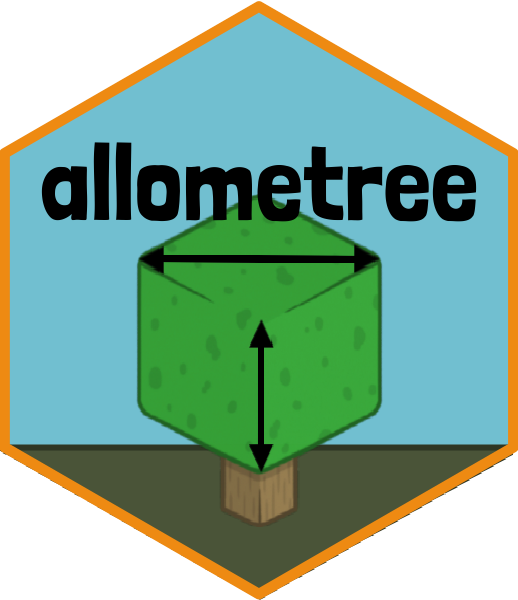

<!-- README.md is generated from README.Rmd. Please edit that file -->

```{r, echo = FALSE}
knitr::opts_chunk$set(
  collapse = TRUE,
  comment = "#>",
  fig.path = "man/figures/"
)
```

# allometree <a href='https://xp-song.github.io/allometree/'></a>

<!-- badges: start -->
[](https://www.tidyverse.org/lifecycle/#experimental)
[](https://github.com/xp-song/allometree/actions)
[](https://github.com/xp-song/allometree/actions)
[](https://github.com/xp-song/allometree/actions)

[](https://travis-ci.com/xp-song/allometree)
[](https://coveralls.io/r/xp-song/allometree?branch=master)
<!-- badges: end -->

## Allometric Scaling of Urban Trees

Develop and use allometric equations relating to the size and structure of urban trees. Refer to [package website](https://xp-song.github.io/allometree/) and [prototype web app](https://xpsong.shinyapps.io/allometree-sg/) for demonstrations of how the package may be used. The package supplements the following study:  

Song, X. P., Lai, H. R., Wijedasa, L. S., Yee, A. T. K., Tan, P. Y., Richards, D. R., Streamlining management practices based on the size allometry of tropical street trees (in prep). 

## Installation

```{r, eval = FALSE}
# Install development version from GitHub
devtools::install_github("xp-song/allometree")
```

## Setup

```{r eval = FALSE}
library(allometree)
```

## Example

```{r}

```


