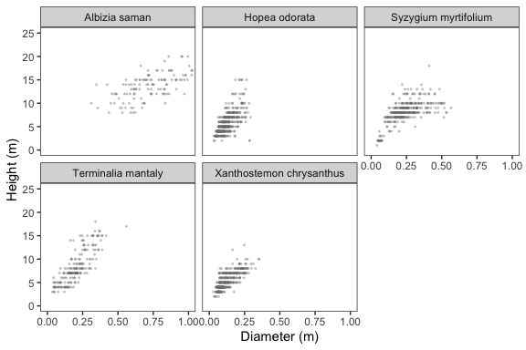
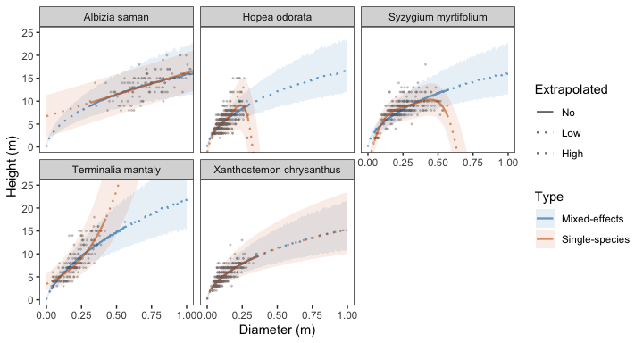

<!-- README.md is generated from README.Rmd. Please edit that file -->

# allometree <a href='https://xp-song.github.io/allometree/'></a>

<!-- badges: start -->

[](https://www.tidyverse.org/lifecycle/#experimental)
[](https://github.com/xp-song/allometree/actions)
[](https://codecov.io/gh/xp-song/allometree)

<!-- badges: end -->

## Allometric Scaling of Urban Trees

Develop and use allometric equations relating to the size and structure
of urban trees. Refer to [package
website](https://xp-song.github.io/allometree/) and [prototype web
app](https://xpsong.shinyapps.io/allometree-sg/) for demonstrations of
how the package may be used. The package supplements the following
study:

Song, X. P., Lai, H. R., Wijedasa, L. S., Tan, P. Y., Edwards, P. J., &
Richards, D. R., Height–diameter allometry for the management of city
trees in the tropics (in review).

## Installation

``` r
# Install development version from GitHub
devtools::install_github("xp-song/allometree")
```

## Setup

``` r
library(allometree)
```

## Example

Allometric equations in this package have been used to predict
relationships between parameters related tree size and structure, such
as age, height, trunk diameter, crown height, crown diameter, leaf area,
etc. They are foundational to other models that estimate the benefits
and hazards associated with trees as they mature and grow in size. See
the vignette ‘[Get started with
allometree](https://xp-song.github.io/allometree/articles/allometree.html)’
for a full description of example datasets and allometric equations.

Let’s develop models to predict tree *height* from trunk *diameter* for
five species in our example dataset `data(urbantrees)`:



 

### Single-species models

One method is to develop allometric models separately for each species
([single-species models](articles/single-species_models.html)). We can
select the best-fit equation for each species in the dataset, or fit
data to specified (i.e. pre-defined) equations, for example, after the
removal of outliers. The example below selects the best-fit equation for
each species in `urbantrees`:

``` r
results <- ss_modelselect_multi(urbantrees, 
                                species = "species", # specify colname of species
                                response = "height", predictor = "diameter") # specify colnames of variables
```

 

We can simulate data across a range of diameter sizes for each species,
and use their respective models to make predictions of tree height. The
simulated data can also be extrapolated beyond the range used to fit the
model. In this example, we specify that predictions should be made
between the range `0` to `1` metre:

``` r
predictions_ss <- ss_simulate(ref_table = results$ss_models_info, 
                              models = results$ss_models, 
                              extrapolate = c(0,1))
```

### Mixed-effects model

Alternatively, the full dataset can be fit to a linear mixed-effects
model with ‘species’ specified as the random effect, using the
`lme4::lmer` function under the hood:

``` r
results <- mix_modelselect(urbantrees, 
                           species = "species", 
                           response = "height", predictor = "diameter")
```

Simulations can likewise be performed across a range of diameter sizes
for each species, and extrapolated beyond the range used to fit the
model:

``` r
predictions_mix <- mix_simulate(data = urbantrees, 
                                modelselect = results,
                                extrapolate = c(0, 1))
```

 

## Visualisations

Model predictions can be visualised alongside the original data using
`ggplot2::ggplot()`:



 

These allometric relationships can then be interpreted according to the
types of variables modelled, and in conjunction with information on the
biology and growth (e.g. environmental and management) conditions
associated with the trees.
